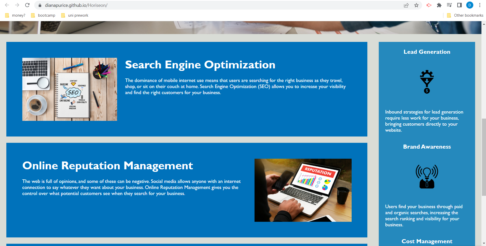
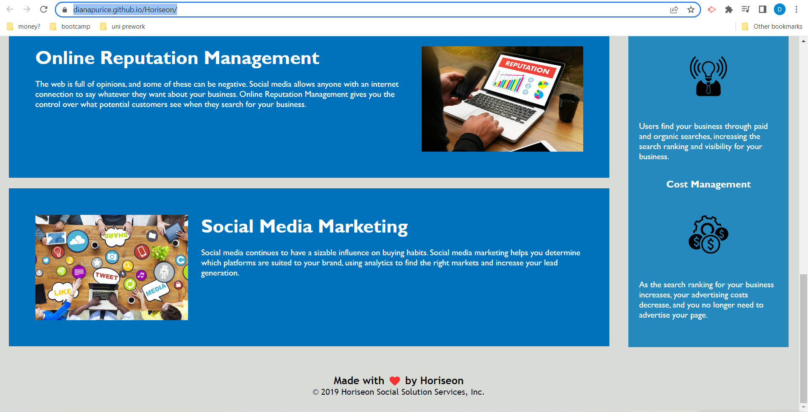
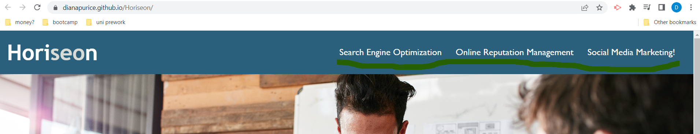

# Horiseon

## Description

The Horiseon marketing agency has asked for their website to be modified so it would be more accessible. This project will clean and organise the provided code, while insuring that all the links are functioning correctly. It will also restructure the CSS file so it can be read easily while using mostly semantic selectors and provide comments throughout it.

## Instalation

1. Clone the repository from GitHub
2. Open it in your favorite code editor

## Usage

Visit the website at https://dianapurice.github.io/Horiseon/
You will find the following:

```md

```

```md

```

```md

```

Use the links in the following picture to nevigate to the required subject:

```md

```

## Credits

Not applicable

## License

Please refer to the LICENCE in the repo.
